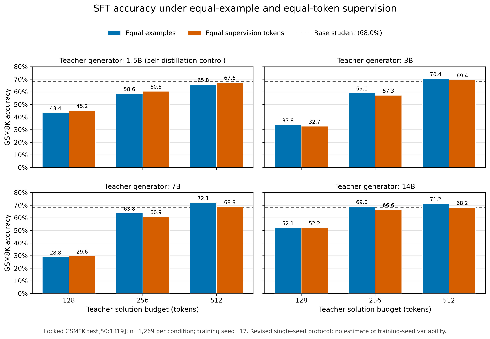

# 当前 SFT 超参数与 GSM8K 同域实验设计审查

审查日期：2026-08-22

## 1. 结论摘要

当前 SFT 配方不能简单归类为“学习率太大”或“整体训练过猛”。更准确的判断是：

1. **名义超参数总体偏保守。** 当前使用 `2e-5` 学习率、1 epoch、LoRA rank 4，只有约 461.6 万个可训练参数；训练 loss 平稳下降，没有 NaN、发散或上下文截断。26 个 adapter 在所适配线性层上的全局 LoRA 更新范数仅为对应基础权重范数的约 0.078%–0.165%。
2. **但不同长度条件的实际优化制度明显不等价。** 有效 batch size 只有 4。短答案数据在绝大多数日志点触发 `max_grad_norm=1` 裁剪，长答案数据几乎不触发；equal-token 条件虽然监督 token 总量接近 31,443，但样本数为 174–881、optimizer step 为 44–221，相差约 5 倍。
3. **目前没有直接证据判断是否过拟合。** 训练没有验证集、没有中途评估，也没有根据 dev metric 选择 checkpoint。训练 loss 下降只能证明拟合训练目标，不能证明泛化继续改善。当前只能说存在小数据任务特化和过拟合风险，不能从训练日志断言已经过拟合。
4. **GSM8K train 到独立 GSM8K test 是合理的同域实验。** 如果问题是“不同 teacher capacity 和 rationale length 如何影响 GSM8K 学生性能”，同一 benchmark 内的 disjoint train/test 能减少任务分布变化，是标准且可解释的设计。
5. **这一设置不能支撑广义数学推理或 OOD 泛化主张。** 当前训练 cohort 还是从前 2,000 道 GSM8K train 题中筛出的 881 道“12 个 teacher-length 条件都至少有一条正确且长度合规轨迹”的交集，代表性弱于完整 GSM8K。
6. **official GSM8K test 已被完整观察。** `test[:50]` 用于 smoke，`test[50:1319]` 用于正式评测。以后若根据这些结果修改超参数，再在相同 test 上报告，就属于自适应复用，不能称为新的未触碰确认性检验。

因此，当前 seed-17 正式结果应保留不动并按既定协议报告；下一轮应先建立不接触 official test 的 dev/holdout，再做小型、统一配方的超参数敏感性研究。对 equal-token robustness，则应优先修正 optimizer-step 不等价，而不是只调低学习率。

## 2. 审查对象与证据级别

本文审查的是 `capacity_length_factorial_seed17_v1` 的正式结果，而不是早期 50 题 smoke 或历史 `student_sft_grid`。

- 父协议：[capacity_length_factorial_v1.json](../configs/capacity_length_factorial_v1.json)
- SFT overlay：[capacity_length_factorial_sft_v1.json](../configs/capacity_length_factorial_sft_v1.json)
- 单 seed overlay：[capacity_length_factorial_run_seed17_v1.json](../configs/capacity_length_factorial_run_seed17_v1.json)
- 完成审计：[completion_audit.json](../results/capacity_length_factorial_seed17_v1/formal/completion_audit.json)
- 数据 manifest：[dataset_manifest.json](../results/capacity_length_factorial_seed17_v1/formal/sft_data/dataset_manifest.json)
- 正式指标：[run_metrics.csv](../results/capacity_length_factorial_seed17_v1/formal/analysis/run_metrics.csv)
- 正式实验报告：[experiment_report.md](../results/capacity_length_factorial_seed17_v1/formal/analysis/experiment_report.md)

完成审计当前为 `status=passed`，包含：

- 72,000 条 raw candidates；
- 881 道 common problems；
- 26/26 个训练 adapter；
- 27 个评测 run，包括 base model；
- 每个 run 1,269 道题，共 34,263 条预测；
- 单一训练 seed 17，证据级别为 `revised_formal_single_seed`。

这里的方法是离线、黑盒、sequence-level response distillation：teacher 先生成可见解答，经过正确性和长度过滤后，student 对 completion 做 token-level cross-entropy SFT。没有 teacher logits、KL loss 或在线 teacher-student loss，因此不应称为经典 logit-level knowledge distillation。

## 3. 当前 SFT 配方

### 3.1 显式配置和实际默认值

| 项目 | 当前值 | 审查意见 |
|---|---:|---|
| Student | Qwen2.5-1.5B-Instruct | 所有条件固定，合理 |
| LoRA | `r=4`, `alpha=16`, dropout `0.05` | 低 rank；缩放 `alpha/r=4` |
| Target modules | 每层 `q/k/v/o` 和 `gate/up/down` | 28 层共 196 个线性矩阵 |
| 可训练参数 | 4,616,192 | 约占 1.5B student 的 0.30% |
| Epoch | 1 | 不算激进，但无法代替 dev-based checkpoint selection |
| Learning rate | `2e-5` | 数值本身不高；小 batch 下仍需敏感性实验 |
| Per-device batch | 4 | 偏小，梯度噪声和裁剪更值得关注 |
| Gradient accumulation | 1 | 有效 batch 仍为 4 |
| Optimizer | AdamW Torch | Transformers 4.48.3 默认值 |
| Scheduler | linear，3% warmup | 每个 run 都在各自总 step 内衰减至接近 0 |
| Max grad norm | 1.0 | 未显式配置，来自 Transformers 默认值 |
| Weight decay | 0.0 | 未显式配置，来自 Transformers 默认值 |
| Loss | completion-only CE | prompt token 被 mask，符合 response distillation |
| Max sequence length | 2,048 | 当前数据最大完整 chat sequence 仅 498 token，无截断 |
| Validation | 无 | 没有 dev loss、early stopping 或 checkpoint selection |

运行环境为 Transformers 4.48.3、TRL 0.9.6、PEFT 0.12.0。legacy TRL 的 `DataCollatorForCompletionOnlyLM` 通过 Qwen assistant 边界 `<|im_start|>assistant\n` 屏蔽 prompt。保存的 adapter 配置确认 `all-linear` 实际展开为七类 attention/MLP projection，而不包括 `lm_head`。

### 3.2 为什么不能说“明显训练过猛”

支持“整体并不激进”的直接证据包括：

- 所有正式训练均正常结束，loss 曲线下降且没有数值异常；
- 1 epoch 内 equal-example 只有 221 个 optimizer steps；
- rank 4 的 LoRA 只训练约 0.30% 参数；
- 对所有 26 个 adapter 计算
  \(\sqrt{\sum_l\|\Delta W_l\|_F^2}/\sqrt{\sum_l\|W_l\|_F^2}\)，其中 `ΔW=(alpha/r)BA`，结果仅为 0.000776–0.001652；
- 最大完整输入序列为 498 token，远低于 2,048，不存在把较长样本系统性截断的问题。

但是，较小的全局权重更新并不能排除行为层面的任务特化。`gold_rationale` adapter 的准确率为 51.14%，`answer_only` 只有 8.98%，而 base 为 68.01%。这说明即使 LoRA 权重范数变化很小，目标格式和回答风格仍可显著改变生成行为。

## 4. 真正需要警惕的优化问题

### 4.1 短答案条件长期处于梯度裁剪制度

Transformers 日志中的 `grad_norm` 是裁剪调用返回的裁剪前总范数。以下为每 10 step 记录一次的观测；“22/22”不代表精确统计全部 221 steps，但足以显示稳定的条件差异。

| Equal-example 条件 | 监督 token | Optimizer steps | `grad_norm>1` 日志点 | 最大 `grad_norm` |
|---|---:|---:|---:|---:|
| 1.5B / short | 73,570 | 221 | 15/22 | 2.38 |
| 1.5B / medium | 110,503 | 221 | 0/22 | 0.91 |
| 1.5B / long | 158,256 | 221 | 0/22 | 0.65 |
| 3B / short | 37,843 | 221 | 22/22 | 4.49 |
| 3B / medium | 65,283 | 221 | 12/22 | 1.81 |
| 3B / long | 109,993 | 221 | 0/22 | 0.95 |
| 7B / short | 31,443 | 221 | 22/22 | 6.13 |
| 7B / medium | 74,339 | 221 | 13/22 | 2.42 |
| 7B / long | 156,656 | 221 | 0/22 | 0.80 |
| 14B / short | 47,653 | 221 | 22/22 | 3.84 |
| 14B / medium | 83,902 | 221 | 9/22 | 1.34 |
| 14B / long | 156,444 | 221 | 0/22 | 0.89 |

这不是“短答案使用了更大学习率”，而是同一 optimizer 配方在不同 target distribution 上触发了不同的非线性干预。短答案通常每个 batch 的有效监督 token 更少，单个错误 token 对 batch-mean loss 和梯度方向的影响更大；有效 batch 只有 4，又放大了方差。降低学习率会缩小参数更新，但不会直接消除裁剪前梯度范数的长度依赖。因此下一步应同时检查 batch size、token-weighted loss 和裁剪比例，而不是只测试更低学习率。

### 4.2 Equal-token 并没有 equalize optimizer exposure

equal-token 的构造正确地把监督 completion token 总数控制在约 31,443，但样本不能被切开，导致样本数和 optimizer steps 仍有显著差异：

| Generator | Short `n/steps` | Medium `n/steps` | Long `n/steps` |
|---|---:|---:|---:|
| 1.5B | 379 / 95 | 252 / 63 | 174 / 44 |
| 3B | 736 / 184 | 424 / 106 | 252 / 63 |
| 7B | 881 / 221 | 381 / 96 | 179 / 45 |
| 14B | 579 / 145 | 327 / 82 | 177 / 45 |

因为 scheduler 在每个 run 自己的总 step 内从 `2e-5` 线性衰减到接近 0，所以 221-step 和 44-step run 的学习率积分、参数更新次数和 batch composition 均不同。以 7B teacher 为例，LoRA 更新范数比值为：

| 7B 条件 | Equal-example `ΔW/W` | Equal-token `ΔW/W` |
|---|---:|---:|
| Short | 0.1652% | 0.1651% |
| Medium | 0.1500% | 0.1215% |
| Long | 0.1471% | 0.0879% |

这说明当前 equal-token 更准确的表述是“equal total completion-token subset”，而不是“equal optimization budget”。它仍然是有价值的 robustness analysis，但不应被解释成彻底排除了监督量和训练强度差异。

### 4.3 缺少验证集是比 2e-5 更直接的问题

所有训练 config 的 `eval_path` 都是 `null`。因此当前实验没有回答以下问题：

- 0.25、0.5、1.0 epoch 中哪个 checkpoint 的 held-out accuracy 最好；
- `2e-5` 是否在早期达到峰值后开始损害泛化；
- short/medium/long 的最佳训练时长是否一致；
- 更大的 batch 是否降低短答案的裁剪频率并改善准确率；
- 训练 loss 较低究竟代表更好泛化还是更强的目标格式记忆。

所以当前证据可以排除明显数值不稳定，却不能排除统计过拟合。

## 5. 当前正式结果如何解释

正式结果最稳定的现象不是“teacher 越大越好”，而是 student 的输出长度和准确率强烈依赖训练 target 长度：

- Base：68.01%，平均输出 241.9 token；
- Equal-example 7B-long：72.10%，平均输出 230.7 token；
- Equal-example 7B-medium：63.75%，平均输出 117.6 token；
- Equal-example 7B-short：28.84%，平均输出 42.8 token；
- Answer-only：8.98%，平均输出 5.3 token。

一个补充的 post-hoc paired McNemar 诊断，以 base 为共同参照并对 26 个 adapter 做 Holm correction 后显示：

- 只有 equal-example 7B-long 的正向差异仍显著：`+4.10 pp`，Holm-adjusted `p=0.0153`；
- equal-example 14B-long 为 `+3.23 pp`，raw `p=0.0118`，但 Holm-adjusted `p=0.1059`；
- equal-token 的 long 条件没有显著优于 base；
- 多数 medium 和全部 short 条件显著低于 base。

这项 McNemar 比较不是原注册 planned contrasts，应只作为诊断。更重要的是，所有数值只有一个训练 seed，不能估计 adapter 训练随机性。因此当前最稳妥的结论是：**足够长且高质量的正确 rationale 可以在 GSM8K 同域内改善 1.5B student，但把解答压得太短会造成明显的推理和输出格式损失；teacher capacity 的独立效应仍受 target 内容、长度和优化制度共同影响。**

早期的 `figures/real_length_budget_sml_stats.png` 属于历史 `real_length_budget` 数据统计，不是 downstream accuracy 图。图中的 medium 柱高于 large 表示训练样本数为 1,541 对 1,350；右上角的 teacher-correct rate 在 small/medium/large 三组都是 1.0，因为这些数据已经经过正确性过滤。该历史数据的题目集合和样本数未像当前 factorial 一样受控，因此不能用那张图推断 medium rationale 的正确率或训练效果优于 large，也不能与当前 881 道 common-intersection 正式结果合并推断。

## 6. 在 GSM8K 上训练并最终应用到 GSM8K 是否合理

### 6.1 合理的部分

GSM8K 官方数据包含 7,473 道 train 和 1,319 道 test 题；train/test 题目不同，但来自相同任务分布。[GSM8K 原论文](https://arxiv.org/abs/2110.14168)和[官方数据仓库](https://github.com/openai/grade-school-math)本身就支持在 train 上学习、在 test 上评价的标准 supervised setting。

对于本项目，使用相同 benchmark 有三个优点：

1. 研究问题本来就是 teacher capacity × teacher solution length 对固定 GSM8K student 的影响；
2. 同域评测减少了题型和答案格式迁移带来的额外方差；
3. 所有 adapter 使用相同的 1,269 道题，可做 problem-level paired contrast。

只要论文表述限定为“GSM8K in-domain response-distillation performance”，这一设计是合理的，不属于 train/test example leakage。

### 6.2 必须限制的主张

[Training on the Test Task Confounds Evaluation and Emergence](https://arxiv.org/abs/2407.07890)明确区分了“training on test data”和“training on the test task”：后者不是研究不端，但会混淆跨模型家族、通用能力和 emergent capability 的比较。对应到本项目：

- 可以主张 GSM8K 同域、任务特定的性能变化；
- 不应直接主张获得了普遍数学推理能力；
- 不应把 7B-long 的优势解释为对所有数学任务都成立的 teacher-capacity 规律；
- 不应把同域 specialization 与基础模型的一般能力提升混为一谈。

此外，训练数据不是随机 GSM8K 子样本。pipeline 先在 4 个 teacher × 3 个长度条件中分别选择最短的正确且预算合规候选，再取 12 个条件 problem ID 的交集。最终 881/2,000 的 cohort 有利于配对公平，但偏向所有条件都能产生正确轨迹的题目，可能更简单，也不代表完整 GSM8K train distribution。

### 6.3 当前 official test 已不再适合后续调参

项目已经使用 `test[:50]` 做早期筛查，并使用 `test[50:1319]` 做正式 seed-17 评测，合计覆盖全部 1,319 道 official test。现有正式结果仍然有效，因为训练配方在正式评测前注册；但从现在开始，如果根据这些结果选择新的学习率、batch 或 epoch，再复用 official test，评测就具有适应性。

后续应从仍未用于 teacher generation 的 GSM8K train 部分冻结新的内部划分：

- SFT source：保持现有 `train[:2000]` 及 881 common intersection；
- Development：`train[2000:3000]`，共 1,000 题；
- New in-domain confirmatory holdout：`train[3000:7473]`，共 4,473 题。

在任何新 teacher generation 或超参数实验前，应保存这两个 split 的 problem IDs、原始输入 hash 和 config hash。它们只能用于 evaluation，不能再进入 teacher generation、SFT 或筛选流程。official test 的 seed-17 结果作为历史正式结果保留；新配方若再次跑 official test，只能标为 secondary adaptive comparison。

这里的 `train[3000:7473]` 是项目内部确认性 holdout，不是 GSM8K 官方 leaderboard test；二者的指标必须分栏报告，不能直接作 leaderboard 数值比较。

## 7. 与相关工作的对照

| 工作 | 数据与训练设置 | 评测范围 | 对本项目的含义 |
|---|---|---|---|
| [Large Language Models Are Reasoning Teachers](https://arxiv.org/abs/2212.10071) | 用大 teacher 生成 rationale，再微调小 student；多条不同 rationale 可进一步增益 | 多种 reasoning tasks | 直接支持当前 sequence-level CoT response distillation 方向 |
| [Teaching Small Language Models to Reason](https://aclanthology.org/2023.acl-short.151/) | student 在 teacher-generated CoT 上微调 | arithmetic、commonsense、symbolic reasoning | 支持小模型学习 teacher reasoning traces，但也表明广义结论需要多任务证据 |
| [Distilling Step-by-Step](https://aclanthology.org/2023.findings-acl.507/) | rationale 被作为额外、多任务监督 | 4 个 NLP benchmarks | 说明 rationale 可提高监督效率；其 multi-task objective 与当前 completion-only SFT 不完全相同 |
| [MetaMath](https://wyliu.com/papers/MetaMath_ICLR.pdf) | 395K 数据，其中 GSM8K-derived 240K；7B/13B full FT 用 AdamW、3 epochs、batch 128、LR `2e-5`、3% warmup；70B QLoRA 用 LR `1e-4` | GSM8K、MATH，并补充 OOD | `2e-5` 并不异常，但 MetaMath 数据量和 batch 远大，不能直接把其配方移植到 881 条 LoRA SFT |
| [MAmmoTH](https://openreview.net/forum?id=yLClGs770I) | MathInstruct 汇总 13 个数学数据集，混合 CoT/PoT | 9 个数学 benchmark | 广义 math-generalist claim 依赖更广的数据和评测；反衬当前结果应限定为 GSM8K |
| [Orca-Math](https://arxiv.org/abs/2402.14830) | 200K synthetic grade-school math problems；SFT 后继续迭代 preference learning | GSM8K pass@1 | 支持 grade-school math specialization 的合理性，但其 200K 规模远大于当前 881 条 |
| [Long Is More for Alignment](https://proceedings.mlr.press/v235/zhao24b.html) | 从通用 instruction 数据中选择 1,000 条最长 response | MT-Bench、AlpacaEval 等 | 提醒长度可能代理信息量和抗过拟合性；不能据此断言 math rationale 越长必然越好 |
| [LoRA](https://arxiv.org/abs/2106.09685) / [QLoRA](https://arxiv.org/abs/2305.14314) | 冻结基础权重并训练低秩更新；QLoRA 展示小规模高质量数据的参数高效微调 | 多模型、多 instruction 数据 | rank 4 本身不是“激进”参数；真正需要通过 dev 检查的是 LR、batch、step 和 target distribution 的联合作用 |

这些工作给出的共同信息不是某个可直接照搬的最佳学习率，而是：rationale 质量、数据多样性、输出长度、样本规模、batch、训练时长和评测域共同决定结果。当前最缺的不是再找一个文献默认值，而是建立能在本项目数据上比较这些因素的独立 dev protocol。

## 8. 推荐的下一轮超参数敏感性研究

### 8.1 原则

- 不修改或覆盖当前 `capacity_length_factorial_seed17_v1` 正式结果；
- 新建独立的 exploratory/tuning root，并标明不属于原注册 factorial；
- 只在 `train[2000:3000]` dev 上选择超参数；
- 为 short/medium/long 选择一个统一 recipe，不能逐条件挑最佳参数，否则 factorial 对比会再次混入训练配方差异；
- 先解决学习率、batch 和训练时长，再考虑增大 LoRA rank。当前没有证据表明 rank 4 是瓶颈。

### 8.2 第一阶段：低成本诊断网格

先使用 teacher=7B 的 equal-example short/medium/long 三个条件，因为它们同时覆盖最严重的裁剪、居中的优化状态和当前最佳 long adapter。

固定项：

- Student：Qwen2.5-1.5B-Instruct；
- LoRA：`r=4, alpha=16, dropout=0.05, all-linear`；
- completion-only loss、bf16、max length 2,048；
- seed 17；
- 同一 881-example 数据与顺序生成规则；
- 最多训练 2 epochs。

网格：

- Learning rate：`{5e-6, 1e-5, 2e-5}`；
- Effective batch size：`{4, 16}`；
- 在 0.25、0.5、1.0、2.0 epoch 保存并评估。

这需要 3 个长度条件 × 3 个学习率 × 2 个 batch 配置，共 18 个训练 run；每个 run 复用四个 checkpoint，不应把四个 checkpoint 当成 72 次独立训练。batch 16 优先直接使用 per-device batch 16；若显存不足，必须先修复或验证尾部 gradient accumulation，不能复用已知可能遗漏 incomplete tail accumulation 的旧路径。

每个 checkpoint 必须记录：

- dev exact-match accuracy 与 paired correctness；
- 平均输出 token、达到 `max_new_tokens` 的比例、答案提取失败率；
- train loss；
- 裁剪前 gradient norm 和 `grad_norm>1` 比例；
- LoRA `ΔW/W`；
- optimizer step、见过的 example 数和有效 completion-token 数；
- config、数据、源码和 checkpoint hashes。

### 8.3 全局配方选择规则

1. 对 short/medium/long 的 dev accuracy 取 macro average；
2. 选择 macro average 最高的 checkpoint/config；
3. 若多个候选与最高值相差不超过 0.5 percentage point，依次选择：裁剪比例更低、训练 epoch 更少、学习率更低的候选；
4. 只锁定一个全局配方，应用到全部 12 个 equal-example cells；
5. dev 只用于选择，不报告为最终确认性结果。

最低计算预算可以继续只跑 seed 17，但结论必须保留“未估计 training-seed variability”。论文级证据则应在配方锁定后，仅对最终 12 个 cells 恢复 seeds 17/42/73，而不必给整个 tuning grid 补三 seed。

### 8.4 确认性评测

锁定配方后，在 `train[3000:7473]` 的 4,473 题 holdout 上一次性评测：

- base student；
- 全部 12 个 equal-example adapters；
- 必要的 gold-rationale calibration；
- greedy decoding 和当前答案抽取规则保持不变。

分析在评测前注册：problem-cluster paired bootstrap、planned factorial contrasts、相对 base 的 paired McNemar，以及相应的 Holm correction。除 accuracy 外同时报告 output length 和 extraction failures，避免把格式变化误判为推理能力变化。

## 9. Equal-token robustness 的推荐修正

若目标是同时控制监督 token 和优化机会，可把约 31,443 个 completion tokens 预先分成 32 个 deterministic token-balanced update buckets，每个 bucket 目标约 983 个有效 token：

1. 每条样本只使用一次；
2. 以非 mask completion-token 数作为装桶权重；
3. 一个 optimizer step 消耗一个 bucket，可以由若干 microbatches 累积构成；
4. loss 按 bucket 内有效 completion-token 数加权，而不是先对每个 microbatch 等权平均；
5. 所有条件固定为 32 个 optimizer steps，最后一个 bucket 的 token gap 单独审计；
6. scheduler、warmup 和 checkpoint step 对所有条件完全一致。

这个设计能近似同时固定总 completion tokens 和 optimizer steps。它仍不能固定“独立题目数”，因为较短轨迹天然需要更多 examples 才达到同一 token budget；因此最终应把 equal-example 和 token-balanced equal-token 看作两个互补 estimand，而不是认为其中一个消除了所有监督量差异。

## 10. 最终建议

### 当前结果可以继续使用

- 保留 seed-17 正式实验，不因本次审查而重写历史结果；
- 主要结论限定为 GSM8K in-domain；
- 把 1.5B teacher cell 称为 self-distillation control；
- 把方法称为 black-box sequence-level response distillation via SFT；
- 明确单 seed、common-intersection selection 和 official-test reuse 的边界。

### 下一步最值得投入计算的事项

1. 先建立新的 GSM8K train-derived dev/holdout；
2. 做 18-run 的 LR × batch × checkpoint sensitivity study；
3. 选择一个跨长度统一配方后再覆盖 12 个 equal-example cells；
4. 将 equal-token 改为 token-balanced fixed-step optimization；
5. 只有在需要 broad mathematical generalization claim 时，再单独审批 SVAMP、ASDiv、MultiArith 或 MATH 等 OOD 协议。

综合判断：**当前 `2e-5`、1 epoch、rank-4 LoRA 不是主要风险；有效 batch、裁剪制度、缺少 dev、equal-token 的 step 不等价以及同域结论边界才是需要优先修正的部分。**
