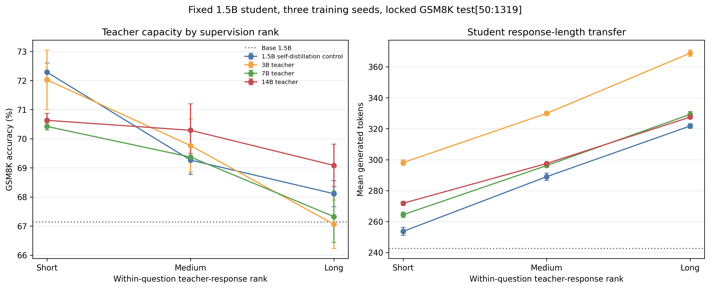

# Short–medium–long 多教师主矩阵结果

更新日期：2026-08-29

## 1. 完成状态

`capacity_length_ranked_sampling_multiteacher_v1` 已完成并通过最终审计。正式矩阵固定 Qwen2.5-1.5B-Instruct student，比较 4 个 teacher、3 个同题相对长度 rank 和 3 个训练 seed：

```text
teacher = {Qwen2.5-1.5B, 3B, 7B, 14B-Instruct}
rank = {short, medium, long}
training_seed = {17, 42, 73}
```

审计确认：

- 36/36 个 LoRA adapter 完整；
- 37 个模型条件完成评测，包括 36 个 adapter 和 1 个未微调 base；
- 每个条件使用相同的 GSM8K `test[50:1319]` 1,269 题，共 46,953 条逐题 prediction；
- 12 个 teacher-rank cell、12 个 teacher 内 rank contrast 和 6 个 teacher-by-rank interaction 均已生成；
- 8 个分析产物以及 PNG/PDF 主图通过哈希审计；
- 结果和 checkpoint 均通过稳定项目路径解析到 BeeGFS。

完成证据：

- [MATRIX_COMPLETE](../../results/capacity_length_ranked_sampling_multiteacher_v1/MATRIX_COMPLETE)
- [最终完成审计](../../results/capacity_length_ranked_sampling_multiteacher_v1/formal/completion_audit.json)
- [自动生成的正式报告](../../results/capacity_length_ranked_sampling_multiteacher_v1/formal/analysis/experiment_report.md)
- [完整分析 JSON](../../results/capacity_length_ranked_sampling_multiteacher_v1/formal/analysis/ranked_multiteacher_analysis.json)
- [评测清单](../../results/capacity_length_ranked_sampling_multiteacher_v1/formal/eval/eval_manifest_formal_shard_00_of_01.json)
- [训练审计](../../results/capacity_length_ranked_sampling_multiteacher_v1/formal/training/audit/training_audit.json)

## 2. 主结果

未微调 base 的准确率为 67.14%，平均输出长度为 242.6 tokens。下表报告每个 teacher-rank cell 的三-seed平均值；每个 adapter 使用相同的 881 道训练题，但监督 token 总量没有被强行相等化。

| Teacher | Rank | Accuracy | Seed SD | Mean output tokens | Supervision tokens |
|---|---|---:|---:|---:|---:|
| 1.5B self-distillation control | Short | 72.29% | 0.32 pp | 253.7 | 158,513 |
| 1.5B self-distillation control | Medium | 69.27% | 0.49 pp | 289.0 | 209,826 |
| 1.5B self-distillation control | Long | 68.11% | 0.45 pp | 321.7 | 281,550 |
| 3B teacher | Short | 72.03% | 1.02 pp | 298.1 | 187,713 |
| 3B teacher | Medium | 69.77% | 0.91 pp | 329.9 | 243,783 |
| 3B teacher | Long | 67.06% | 0.83 pp | 368.8 | 320,450 |
| 7B teacher | Short | 70.42% | 0.12 pp | 264.4 | 171,252 |
| 7B teacher | Medium | 69.37% | 0.12 pp | 296.2 | 213,621 |
| 7B teacher | Long | 67.32% | 0.88 pp | 329.3 | 280,168 |
| 14B teacher | Short | 70.63% | 0.24 pp | 271.8 | 174,261 |
| 14B teacher | Medium | 70.29% | 0.91 pp | 297.5 | 219,350 |
| 14B teacher | Long | 69.08% | 0.73 pp | 327.5 | 280,657 |



有三个直接观察：

1. 四个 teacher 下的三-seed均值都呈 `short > medium > long` 的准确率排序。
2. 四个 teacher 下的 student 输出长度都呈 `short < medium < long`，short-long 的平均输出长度差为 55.7 至 70.7 tokens，表明训练轨迹长度能够稳定传递到 student 行为。
3. teacher 越大不等于 student 越准。最高均值来自 1.5B self-distillation short cell（72.29%），与 3B short cell（72.03%）接近；这些跨 teacher 的描述性排序不是预注册的显著性比较。

## 3. 预注册统计比较

正值表示左侧 rank 更准确。Holm 校正覆盖全部 12 个 teacher 内 rank contrasts，而不是分别在每个 teacher 内校正三次。

| Teacher | Contrast | Effect | 95% crossed-bootstrap CI | Holm p | Holm significant |
|---|---|---:|---:|---:|---:|
| 1.5B control | Short vs Long | +4.18 pp | [+2.15, +6.25] pp | <0.0001 | Yes |
| 3B | Short vs Long | +4.96 pp | [+2.39, +7.43] pp | 0.0044 | Yes |
| 7B | Short vs Long | +3.10 pp | [+0.87, +5.31] pp | 0.0828 | No |
| 14B | Short vs Long | +1.55 pp | [-0.63, +3.70] pp | 0.8060 | No |

其余比较中，1.5B short-medium 为 `+3.02 pp`、Holm `p=0.0500`，分析代码按严格小于 0.05 的规则标记为不显著；3B medium-long 为 `+2.71 pp`、Holm `p=0.0828`。完整的 12 项结果见正式报告。

short-long 效应在 1.5B/3B teacher 下较大，在 7B/14B 下较小，但 6 个预注册 teacher-by-rank interaction 在 Holm 校正后均不显著。最强的描述性 interaction 是 14B 相对 3B 的 short-long 效应减少 `3.41 pp`，95% crossed-bootstrap CI `[-6.54,-0.37] pp`，raw `p=0.0316`，但 Holm `p=0.1896`。因此当前结果支持长度传递和部分 teacher 内 short-long 差异，不足以声称 teacher capacity 已被证明会调节 length-rank effect。

## 4. 解释边界

- 这是对已经观察过的 GSM8K `test[50:1319]` 的锁定比较，不是新的 untouched confirmation；论文声明仍限于 GSM8K。
- 每个 cell 只有三个训练 seed，可以给出初步 seed 波动，但不足以精确估计 seed-population variance。
- 训练采用 equal-example；监督 token 从 158,513 到 320,450 不等，因此结果不能单独归因于文本长度或优化曝光量。
- short、medium、long 是同题正确候选池中的相对 order statistic，同时可能编码不同解题策略、措辞和过程质量；correctness filtering 不是过程等价性证明。
- teacher-by-rank interaction 没有通过 family-wise correction，因此当前结果没有达到直接扩大到完整 student-capacity 矩阵的预设 gate。

## 5. 建议的下一阶段

1. 先完成 `K_max=32`、嵌套 `K={4,8,16,32}` 的 sampling-density 数据审计，判断 minimum/maximum 效应是否由 order-statistic extremity 驱动。
2. 在预先固定的关键端点补 equal-supervision-token 和 random-correct 控制，分离 rank selection、监督 token 暴露和普通 rejection sampling。
3. 把 independent short 与 paired-rewrite short 做机制对照，判断收益来自换用更简洁的解题路径，还是来自删除同一路径中的冗余。
4. 若要验证 teacher-capacity interaction，应预注册更高 power 的复现，而不是根据本次 14B-vs-3B raw interaction 重新挑选显著条件。
5. student capacity 和任何 OOD 扩展使用独立协议；MATH-500 保持 evaluation-only，且不得用当前 formal outcomes 调参。

## 6. 本次调度恢复记录

原 DAG 中受严格 idle gate 阻塞的训练 shard 被安全替换：C49 完成 shard 0，C31 原作业完成 shard 1，C32 的 replacement job `277622` 完成 shard 2。训练审计随后确认全部 36 个 adapter。评测由 C49 主进程维护唯一 authoritative manifest，C32 helper jobs `277629` 和 `277642` 生成互斥任务区间；主进程重新验证这些预测后将 13 项记录为 `skipped_complete`，其余 24 项记录为 `complete`。被取消的 C32 初始评测尝试保存在 `formal/eval_attempt_277627_incomplete_20260828T2328`，没有被当作正式结果。

最终自动流程在生成全部分析产物后，因 checkpoint 稳定路径由父目录软链接提供而触发了过严的审计条件。审计已改为同时验证“路径本身或其项目内祖先存在软链接”以及最终解析路径位于 BeeGFS；正式 audit 记录 result root 的直接软链接和 checkpoint root 的 `checkpoints` 父级软链接，随后通过。C49 的用户 `grabgpu` allocation `277424` 保持开启，没有终止 keepalive 或其他工作负载。
